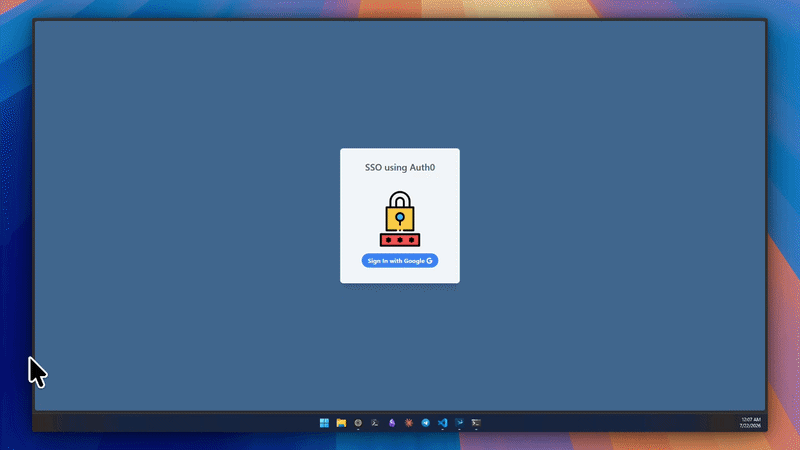

<div align="center">



# OAuth 2.0 + Auth0 SSO

Single Sign-On на Go с аутентификацией через Auth0 и Google.

[](https://go.dev/)
[](https://auth0.com/)
[](https://gin-gonic.com/)
[](LICENSE)

</div>

---

## Quick Start

```bash
git clone https://github.com/qqwozz/OAuth_2.0.git
cd OAuth_2.0
cp .env.example .env
# Заполните .env своими данными Auth0
go run main.go
```

Откройте **http://localhost:8080** → нажмите **Sign In with Google**

---

## Configuration

| Variable | Required | Description |
|----------|:--------:|-------------|
| `AUTH0_DOMAIN` | Yes | Auth0 domain |
| `AUTH0_CLIENT_ID` | Yes | Auth0 client ID |
| `AUTH0_CLIENT_SECRET` | Yes | Auth0 client secret |
| `AUTH0_REDIRECT_URL` | Yes | `http://localhost:8080/callback` |
| `PORT` | No | `8080` |

---

## Routes

| Method | Path | Auth | Description |
|:------:|------|:----:|-------------|
| `GET` | `/` | - | Home |
| `GET` | `/login` | - | Redirect to Auth0 |
| `GET` | `/callback` | - | OAuth callback |
| `GET` | `/profile` | Yes | User profile |
| `GET` | `/avatar` | Yes | Avatar proxy |
| `GET` | `/logout` | - | Logout |

---

## License

[MIT](LICENSE) © [Dima Kiselev](https://github.com/qqwozz)
